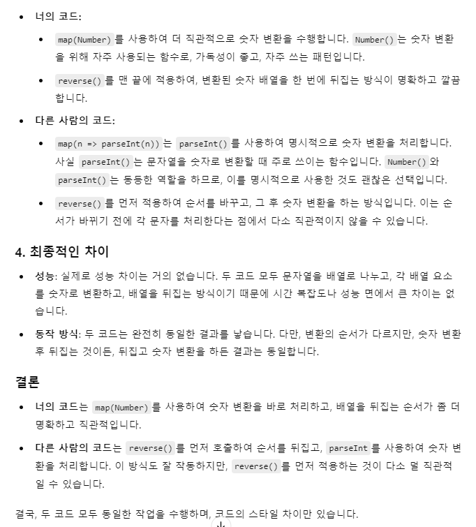

## 자연수 뒤집어 배열로 만들기

> 자연수 `n`을 뒤집어 각 자리 숫자를 원소로 가지는 배열 형태로 리턴해주세요. 예를들어 `n`이 12345이면 [5,4,3,2,1]을 리턴합니다.

<br>

**1. 풀이**

- 13번 문제에서 학습했던 `(n + "").split("")`를 활용해봤다. 직접 써보니 재밌다 😎
- `split()` 한 배열에 `map(Number)`를 사용해 String 타입을 Number로 바꿔주고, `.reverse()`로 뒤집어줬다.

<br>

**2.알게 된 내용**

- 이번 문제에서 알게된 건.. 생각보다 내가 직관적인 코드를 잘 짤지도 모른다는 거다..! 😯 다른 사람의 풀이를 보고 GPT한테 두 풀이를 비교해달라고 요청했는데, 그 내용은 아래와 같다.

```javascript
// 다른 사람의 풀이
function solution(n) {
  return (n + "")
    .split("")
    .reverse()
    .map((n) => parseInt(n));
}
```



- 어쨌든 동일한 기능을 하는 코드이나 내가 작성한 방식이 좀 더 명확하다고 한다. 사람도 아닌 AI에게 받은 칭찬인데도 생각보다 뿌듯하고 더 잘해야겠다는 마음이 드는 걸 보면 역시 칭찬은 누가 해주던 듣기 좋은 원동력이 되는 것 같다!
