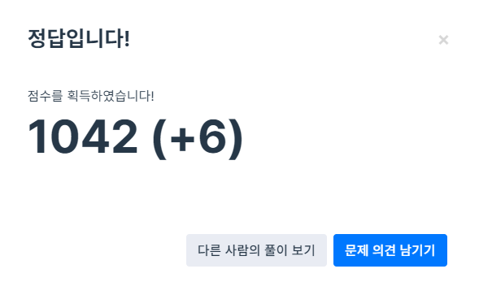

## 콜라츠 추측

> 1937년 Collatz란 사람에 의해 제기된 이 추측은, 주어진 수가 1이 될 때까지 다음 작업을 반복하면, 모든 수를 1로 만들 수 있다는 추측입니다. 작업은 다음과 같습니다.
>
> ```
> 1-1. 입력된 수가 짝수라면 2로 나눕니다.
> 1-2. 입력된 수가 홀수라면 3을 곱하고 1을 더합니다.
> 2. 결과로 나온 수에 같은 작업을 1이 될 때까지 반복합니다.
> ```
>
> 예를 들어, 주어진 수가 6이라면 6 → 3 → 10 → 5 → 16 → 8 → 4 → 2 → 1 이 되어 총 8번 만에 1이 됩니다. 위 작업을 몇 번이나 반복해야 하는지 반환하는 함수, solution을 완성해 주세요. 단, 주어진 수가 1인 경우에는 0을, 작업을 500번 반복할 때까지 1이 되지 않는다면 –1을 반환해 주세요.
> <br>

**1. 풀이**


- 전에는 잘 풀면 + 점수가 높은 줄 알고 좋아했는데 이젠 6점이나 줬다고 하면 '어?.. 다들 나처럼 안풀었나?' 하는 마음이 먼저 든다.. 근데 다른 사람의 풀이를 보니 이번엔 진짜 잘 풀어서 준 것 같은 느낌 😉 내가 제일 깔끔하게 짰어!
- `if else`문으로 우선 `num`이 1인지를 구분해주고, 1이 아닐 경우 `while`문을 사용해 `num`이 1이 될 때까지 반복해주었다. 반복 말미에 `count`에 `++`를 해주어 해당 반복문이 몇 번 돌아갔는지를 카운트해준다.
- `count`가 500이상일 경우 -1를, 그 미만일 경우 `count` 자체 즉 반복문이 돌아간 횟수를 return 해주었다.

<br>

**2. 알게 된 내용**

- while 반복문을 거의 처음 써본 것 같아서 굉장히 익숙하지 않은 느낌? 그치만 조건을 달아놓고 반복할 수 있다는 점이 매력적이라 차차 많이 적용해보며 친해질 예정이다!
